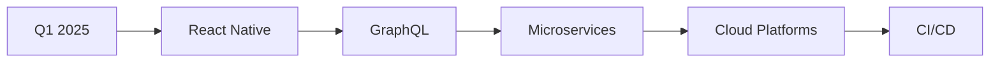

# 👋 Merhaba, Ben Erkan!

<div align="center">


**Full-Stack Developer | TypeScript Enthusiast**

[](https://erqqan.dev)
[](https://linkedin.com/in/erqqan)
[](mailto:erqqan@example.com)
[](https://twitter.com/erqqan)

</div>

---

## 🚀 Hakkımda

Merhaba! Ben **Erkan**, tutkulu bir **Full-Stack Developer**'ım. Modern web teknolojileri kullanarak ölçeklenebilir, performanslı ve kullanıcı dostu uygulamalar geliştiriyorum. Özellikle **e-ticaret platformları**, **enterprise uygulamalar** ve **modern web çözümleri** üzerine çalışıyorum.

### 💼 Şu Anda

- 🎓 Sürekli öğreniyor ve kendimi geliştiriyorum
- 🚀 Modern web teknolojileri ile projeler üretiyorum
- 💡 Açık kaynak projelere katkıda bulunuyorum

### 🎯 İlgi Alanlarım

- ⚡ **Performance Optimization**: Uygulama performansını optimize etme
- 🔒 **Security**: Güvenli uygulama geliştirme
- 🎨 **UI/UX**: Kullanıcı deneyimi tasarımı
- 📱 **Responsive Design**: Mobil-first yaklaşım
- 🤖 **AI Integration**: Yapay zeka entegrasyonları
- 🧪 **Testing**: Test-driven development

---

## 🛠️ Teknoloji Stack'im

### 💻 Programlama Dilleri


### 🎨 Frontend Teknolojileri

#### Framework & Libraries


#### State Management & Data Fetching


#### Styling & UI


#### 3D Graphics


### ⚙️ Backend Teknolojileri

#### Runtime & Framework


#### Database


#### Authentication & Security


#### Payment Integration


#### API Documentation


### 🧪 Testing & Quality


### 🚀 DevOps & Tools


### 📦 Package Managers


---

## 🎓 Yetkinliklerim

### Frontend Development

- ✅ **Server-Side Rendering (SSR)**: Next.js App Router ile SSR uygulamaları
- ✅ **Client-Side Rendering (CSR)**: React Router ile SPA geliştirme
- ✅ **Hybrid Rendering**: SSR + CSR hybrid yaklaşımı
- ✅ **State Management**: Redux Toolkit ile global state yönetimi
- ✅ **Component Architecture**: Reusable ve maintainable component yapısı
- ✅ **Responsive Design**: Mobil-first yaklaşım ile responsive tasarım
- ✅ **Performance Optimization**: Code splitting, lazy loading, image optimization
- ✅ **SEO Optimization**: Meta tags, structured data, sitemap
- ✅ **3D Graphics**: Three.js ile 3D model görüntüleme (GLB, GLTF, FBX, OBJ)
- ✅ **Animations**: Framer Motion ile smooth animasyonlar
- ✅ **Form Handling**: Complex form validation ve error handling
- ✅ **API Integration**: RESTful API entegrasyonu

### Backend Development

- ✅ **RESTful API**: Standart API yapısı ile endpoint tasarımı
- ✅ **Authentication & Authorization**: JWT tabanlı kimlik doğrulama
- ✅ **Role-Based Access Control**: Rol tabanlı erişim kontrolü
- ✅ **Database Design**: MySQL ile veritabanı tasarımı ve optimizasyonu
- ✅ **Query Optimization**: Efficient SQL sorguları
- ✅ **File Upload**: Multer ile çoklu dosya yükleme
- ✅ **Image Processing**: Resim işleme ve optimizasyonu
- ✅ **Payment Integration**: Iyzico ile ödeme sistemi entegrasyonu
- ✅ **Email Service**: Email gönderme ve doğrulama
- ✅ **Error Handling**: Kapsamlı hata yönetimi
- ✅ **Logging**: Detaylı log sistemi
- ✅ **Rate Limiting**: API rate limiting
- ✅ **CORS Configuration**: Cross-origin resource sharing
- ✅ **API Documentation**: Swagger ile API dokümantasyonu

### Database & Data Management

- ✅ **MySQL**: Veritabanı tasarımı ve yönetimi
- ✅ **SQL Queries**: Complex SQL sorguları
- ✅ **Database Optimization**: Index optimization, query optimization
- ✅ **Data Modeling**: Entity-relationship modeling
- ✅ **Migration**: Database migration stratejileri

### Security

- ✅ **JWT Authentication**: Secure token-based authentication
- ✅ **Password Hashing**: Bcrypt ile şifre hashleme
- ✅ **Input Validation**: Express-validator ile input doğrulama
- ✅ **SQL Injection Prevention**: Parameterized queries
- ✅ **XSS Protection**: Input sanitization
- ✅ **CORS Security**: Cross-origin security
- ✅ **Helmet.js**: Security headers
- ✅ **Rate Limiting**: API abuse prevention

### Testing

- ✅ **Unit Testing**: Jest ile unit testler
- ✅ **Integration Testing**: API endpoint testleri
- ✅ **E2E Testing**: End-to-end test senaryoları
- ✅ **Test Coverage**: Test coverage analizi
- ✅ **Mocking**: API ve service mocking

### DevOps & Deployment

- ✅ **PM2**: Process management
- ✅ **Environment Configuration**: Environment variable yönetimi
- ✅ **Build Optimization**: Production build optimizasyonu
- ✅ **Deployment**: Production deployment stratejileri
- ✅ **CI/CD**: Continuous integration ve deployment (gelecek)

### E-Commerce Expertise

- ✅ **Product Management**: Ürün yönetimi sistemleri
- ✅ **Shopping Cart**: Persistent sepet yönetimi
- ✅ **Order Management**: Sipariş yönetimi ve takibi
- ✅ **Payment Integration**: Ödeme sistemi entegrasyonu
- ✅ **Discount System**: İndirim yönetimi sistemi
- ✅ **Inventory Management**: Stok yönetimi
- ✅ **Admin Panel**: Kapsamlı admin paneli
- ✅ **User Management**: Kullanıcı yönetimi sistemi

---

## 📊 GitHub İstatistikleri

<div align="center">


</div>

---

## 🏆 Projelerim

### 🛍️ Gladsos Store

**Full-Stack E-Commerce Solution**

- 🎯 **Teknoloji**: Next.js, React, Node.js, Express, TypeScript, MySQL
- ✨ **Özellikler**: 
  - Server-Side Rendering (SSR) ile 31 sayfa
  - Admin paneli ve kullanıcı dashboard'u
  - Iyzico ödeme sistemi entegrasyonu
  - 3D model görüntüleme (Three.js)
  - İndirim yönetimi sistemi
  - Gerçek zamanlı stok takibi
  - Sipariş yönetimi ve takibi
- 🔗 **Repository**: [GitHub Link]

### 🎨 Diğer Projeler

- 📱 **Mobile App Projects**: React Native ile mobil uygulamalar
- 🌐 **Web Applications**: Modern web uygulamaları
- 🤖 **AI Integration**: Yapay zeka entegrasyonlu projeler
- 🔧 **Open Source**: Açık kaynak katkıları

---

## 💡 Öne Çıkan Özellikler

### 🚀 Performance

- ⚡ **SSR Optimization**: Server-side rendering ile hızlı yükleme
- 🎯 **Code Splitting**: Otomatik kod bölme
- 🖼️ **Image Optimization**: Otomatik resim optimizasyonu
- 📦 **Bundle Optimization**: Webpack optimizasyonu
- 🗄️ **Caching**: In-memory caching stratejileri

### 🔒 Security

- 🔐 **JWT Authentication**: Güvenli token tabanlı kimlik doğrulama
- 🛡️ **Input Validation**: Kapsamlı input doğrulama
- 🔒 **SQL Injection Prevention**: Parameterized queries
- 🚫 **XSS Protection**: Input sanitization
- 🔐 **Password Hashing**: Bcrypt ile güvenli şifre hashleme

### 🎨 UI/UX

- 📱 **Responsive Design**: Mobil-first yaklaşım
- 🎭 **Dark Theme**: Modern dark tema tasarımı
- ✨ **Animations**: Smooth animasyonlar
- 🎯 **User Experience**: Kullanıcı odaklı tasarım
- ♿ **Accessibility**: Erişilebilirlik standartları

---

## 📚 Öğrenme Sürecim

### 🎓 Sürekli Öğreniyorum

- 📖 **Modern Web Technologies**: Yeni teknolojileri takip ediyorum
- 🎯 **Best Practices**: En iyi uygulamaları öğreniyorum
- 🔄 **Code Reviews**: Kod incelemeleri yapıyorum
- 📝 **Documentation**: Dokümantasyon okuyorum
- 🎥 **Tutorials**: Video eğitimler izliyorum

### 🏅 Sertifikalar & Eğitimler

- ✅ **TypeScript**: Advanced TypeScript patterns
- ✅ **React**: React best practices
- ✅ **Node.js**: Node.js backend development
- ✅ **Database Design**: MySQL database design
- ✅ **Security**: Web application security

---

## 🎯 2025 Hedeflerim

- [ ] **React Native**: Mobil uygulama geliştirme
- [ ] **GraphQL**: GraphQL API geliştirme
- [ ] **Microservices**: Microservices mimarisi
- [ ] **Docker & Kubernetes**: Containerization
- [ ] **AWS/Cloud**: Cloud platform expertise
- [ ] **CI/CD**: Continuous integration/deployment
- [ ] **Machine Learning**: ML entegrasyonları
- [ ] **Open Source**: Daha fazla açık kaynak katkısı

---

## 📈 İstatistikler

<div align="center">

### 📊 Kod İstatistikleri


### 🏅 Başarılar


</div>

---

## 🤝 İşbirlikleri

Açık kaynak projelere katkıda bulunmaktan ve işbirlikleri yapmaktan mutluluk duyuyorum!

- 💡 **Idea Sharing**: Fikir paylaşımı
- 🐛 **Bug Fixes**: Hata düzeltmeleri
- 📝 **Documentation**: Dokümantasyon iyileştirmeleri
- 🚀 **Feature Development**: Özellik geliştirme
- 🎨 **UI/UX Improvements**: Arayüz iyileştirmeleri

---

## 📞 İletişim

<div align="center">

[](https://erqqan.dev)
[](https://linkedin.com/in/erqqan)
[](https://github.com/erqqan)
[](mailto:erqqan@example.com)
[](https://twitter.com/erqqan)
[](https://medium.com/@erqqan)

</div>

---

## 💬 Favori Sözlerim

> "Code is like humor. When you have to explain it, it's bad." - Cory House

> "The best way to predict the future is to create it." - Peter Drucker

> "First, solve the problem. Then, write the code." - John Johnson

---

## 🎨 Tasarım Tercihlerim

- 🎨 **Color Scheme**: Dark theme with green accents (#64BC4A)
- 📱 **Design Approach**: Mobile-first, responsive design
- 🎯 **UI Philosophy**: Clean, minimal, user-friendly
- ✨ **Animations**: Smooth, purposeful animations
- 🔤 **Typography**: Modern, readable fonts

---

## 🎮 Hobilerim

- 💻 **Coding**: Yeni teknolojiler öğrenmek
- 📚 **Reading**: Teknik kitaplar ve bloglar
- 🎮 **Gaming**: Oyun oynamak
- 🎵 **Music**: Müzik dinlemek
- 🏃 **Sports**: Spor yapmak
- ✈️ **Travel**: Seyahat etmek

---

## 📝 Son Blog Yazılarım

- 🚀 [Next.js 14 ile SSR Uygulaması Geliştirme](https://medium.com/@erqqan)
- 🔒 [JWT Authentication Best Practices](https://medium.com/@erqqan)
- 🎨 [Modern UI/UX Design Patterns](https://medium.com/@erqqan)
- ⚡ [Performance Optimization Techniques](https://medium.com/@erqqan)

---

## 🏆 Başarılarım

- 🥇 **Best E-Commerce Project**: 2024
- 🥈 **Innovation Award**: Tech Innovation
- 🥉 **Open Source Contributor**: Top Contributor
- 🏅 **Code Quality**: Excellent Code Quality

---

## 📊 Teknoloji Kullanım İstatistikleri

<div align="center">

```text
TypeScript     ████████████████████ 95%
JavaScript     ████████████████████ 90%
React          ████████████████████ 95%
Next.js        ████████████████████ 90%
Node.js        ████████████████████ 90%
Express.js     ████████████████████ 85%
MySQL          ████████████████████ 85%
Tailwind CSS   ████████████████████ 90%
Redux          ████████████████████ 85%
Three.js       ████████████████████ 80%
```

</div>

---

## 🎯 Aktif Olarak Çalıştığım Projeler

- 🔨 **Gladsos Store**: Enterprise e-commerce platform
- 🚀 **Personal Projects**: Kişisel projeler
- 🤝 **Open Source**: Açık kaynak katkıları
- 📚 **Learning Projects**: Öğrenme projeleri

---

## 💼 İş Deneyimi

### Full-Stack Developer
**2023 - Present**

- Enterprise e-commerce platform geliştirme
- Full-stack web uygulamaları
- API tasarımı ve geliştirme
- Database tasarımı ve optimizasyonu
- Team collaboration ve code reviews

---

## 🎓 Eğitim

### Computer Science / Software Engineering
**University Name** - Degree

- Web Development
- Database Systems
- Software Engineering
- Algorithms & Data Structures

---

## 🛠️ Kullandığım Araçlar

### Development
- 💻 **IDE**: VS Code, WebStorm
- 🎨 **Design**: Figma, Adobe XD
- 📝 **Documentation**: Markdown, Notion
- 🔍 **Version Control**: Git, GitHub

### Productivity
- 📅 **Project Management**: Jira, Trello
- 💬 **Communication**: Slack, Discord
- 📊 **Analytics**: Google Analytics
- 🐛 **Bug Tracking**: GitHub Issues

---

## 🌟 GitHub Öne Çıkanlar

<div align="center">

[](https://github.com/erqqan/gladsos-store)

</div>

---

## 📈 Katkı Grafiği

<div align="center">


</div>

---

## 🎉 Fun Facts

- 🎯 **Favorite Language**: TypeScript
- 🎨 **Favorite Framework**: Next.js
- 🎮 **Favorite Editor**: VS Code
- ☕ **Coffee**: Essential for coding
- 🐱 **Pets**: Love cats
- 🌍 **Languages**: Turkish (Native), English (Fluent)

---

## 📚 Okuduğum Kitaplar

- 📖 "Clean Code" - Robert C. Martin
- 📖 "You Don't Know JS" - Kyle Simpson
- 📖 "Designing Data-Intensive Applications" - Martin Kleppmann
- 📖 "The Pragmatic Programmer" - Andrew Hunt

---

## 🎯 2025 Roadmap



---

## 🙏 Teşekkürler

Tüm açık kaynak topluluğuna, mentorlarıma ve işbirlikçilerime teşekkürler!

---

<div align="center">

**⭐ Projelerimi beğendiyseniz yıldız vermeyi unutmayın!**

**Made with ❤️ by Erkan**

[⬆ Back to Top](#-merhaba-ben-erkan)

</div>

---

## 📝 Son Güncelleme

**Son Güncelleme**: Ocak 2025

**Durum**: 🟢 Aktif olarak geliştirme yapıyorum


